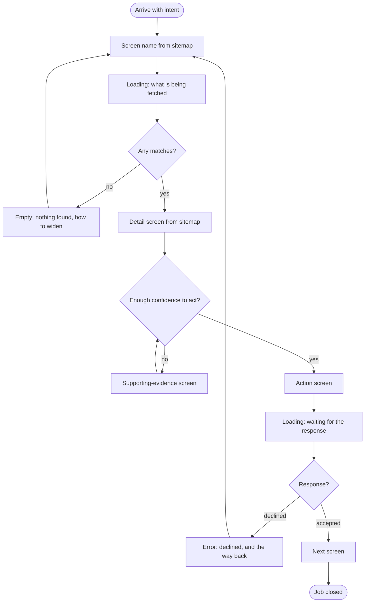
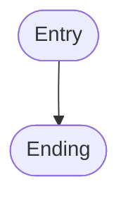

<!-- filled by /dsf:ia — start from this skeleton, do not restructure it -->

# Flows

**The main-job flow, complete, plus 2 to 3 key related-job flows** from `jtbd.md`. One
`flowchart TD` per flow, each under a heading naming its job.

Every flow must contain:

- **screen nodes** `[in square brackets]`, named **exactly** as in `ia/sitemap.md`;
- **decision points** as diamonds `{question?}` with labelled branches `-->|yes|` / `-->|no|`;
- **states as their own nodes**, not just the happy path: empty (nothing found), error
  (rejected or failed), loading (waiting);
- **both endings** — success *and* the dead ends where a person can get stuck.

Every screen node must exist in `ia/sitemap.md`. If a new one appears while drawing, add it to
the sitemap with its job — do not leave it living only here.

Mermaid must be syntactically valid and render on GitHub: node text containing spaces or a
colon goes in quotes `["…"]`. Under each diagram, list the decisions and the states in words.

---

## Flow 1 — `[?]` (main job)

**Decisions in words**

| Decision | Yes branch | No branch |
|---|---|---|
| `[?]` | `[?]` | `[?]` |

**States in words**

| State | What triggers it | The way out |
|---|---|---|
| Loading | `[?]` | `[?]` |
| Empty | `[?]` | `[?]` |
| Error | `[?]` | `[?]` |

**Endings:** success — `[?]` · dead end — `[?]`

---

## Flow 2 — `[?]` (related job)

**Decisions in words:** `[?]`
**States in words:** `[?]`
**Endings:** success — `[?]` · dead end — `[?]`

---

## Flow 3 — `[?]` (related job)

---

## Coverage

Every flow traces back to a job in `jtbd.md`, and every node exists in `ia/sitemap.md`.

| Flow | Job | Screen nodes | States present | Both endings? |
|---|---|---|---|---|
| `[?]` | `[?]` | `[?]` | empty · error · loading | `[?]` |

**Nodes added to `ia/sitemap.md` while drawing these flows:**

- `[?]` — job it serves: `[?]`
