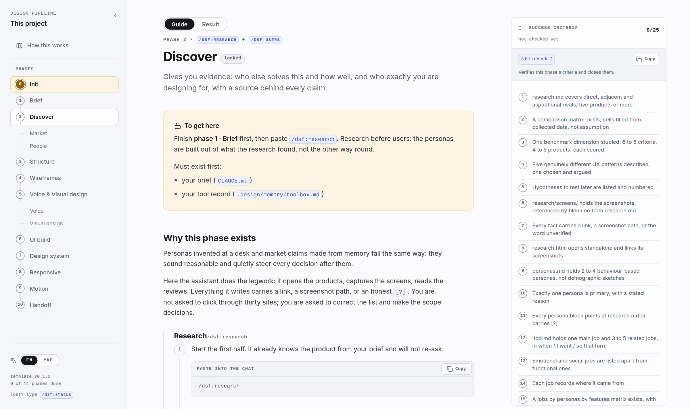
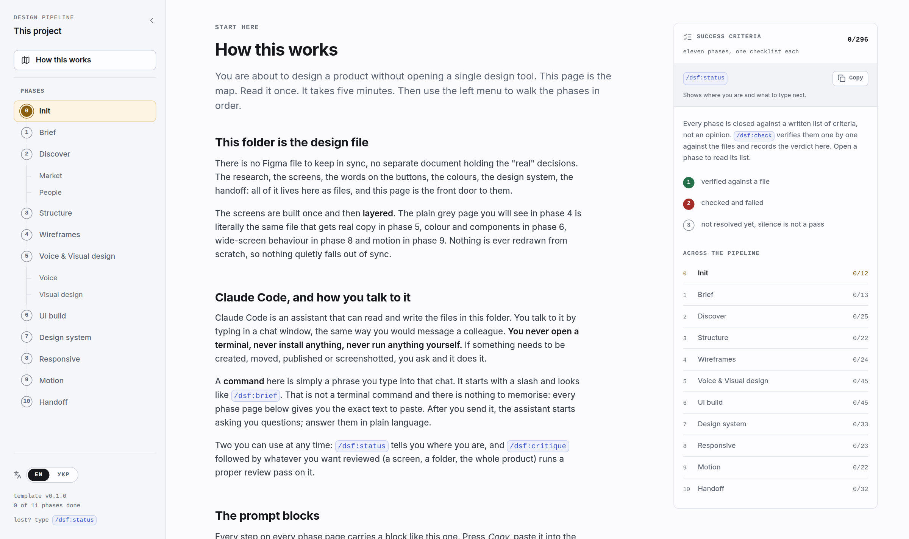

# design-spec-framework

Spec-Driven Development for product design. Clone the template, open it in Claude Code, and walk a product from a blank folder to a handoff-ready design system with `/dsf:*` commands — the way [spec-kit](https://github.com/github/spec-kit) does it for code, but for design.

The repo is the design file — and the source of truth. Figma is not required, and not forbidden: if your team lives in Figma, the finished system can be exported there through the Figma MCP at handoff, from a design system that already exists as code.

## What it looks like

The project home page (`index.html`) is the state view of the run — phases on the left, the step-by-step guide with copy-paste prompts in the middle, the phase's done-criteria on the right:



"How this works" states the working contract on one screen: the page tracks state, the chat executes:



## Why this exists

Most product design work has three chronic problems, and none of them is about talent:

1. **Decisions evaporate.** Research lives in a Notion page nobody reopens, the reasoning behind a color lives in a Slack thread, tone of voice lives in the designer's head. Six months later nobody can say *why* the product looks and speaks the way it does — so every redesign starts from zero.
2. **The mockup is a dead end.** A Figma file is a *picture of* the product, not the product. At handoff it gets re-implemented from scratch, states and edge cases get lost in translation, and from that day on the design and the code drift apart forever.
3. **AI without discipline produces slop.** Ask a model for "a cozy design" and you get the same cream-and-terracotta page as everyone else, happy-path screens with no empty/error/loading states, invented user insights, and celebration emoji in system messages. The model is powerful; unguided, it defaults to average.

design-spec-framework attacks all three with one move: **the entire design process becomes versioned, reviewable artifacts in a git repo, produced and consumed by an AI agent under strict, written rules.**

## Goals

- **One source of truth that compounds.** Every phase reads the artifacts of the previous phases and adds a layer. The grey wireframe from phase 4 is the *same HTML file* that ships styled and tokenized in phase 6, responsive in phase 8 and animated in phase 9. Nothing is redrawn; nothing is re-explained.
- **Design decisions with receipts.** Every persona claim cites research or is marked `[?]`. Every screen names the job it serves. Every color traces to a written attribute, every attribute to data or the designer's recorded taste. "Because it looks nice" is not a valid provenance.
- **The agent executes, you judge.** The framework automates production — research collection, screen assembly, parallel rollout, critique — but stops at every taste and scope decision. Direction choice, defect priorities, "keep it" — always human, always logged.
- **Handoff that needs no meeting.** The end state is a repo a new developer (or a fresh AI session) can pick up and extend without a single verbal explanation — verified by an actual fresh-context test.

## Classic process vs. design-spec-framework

| | Classic (Figma-centric) | design-spec-framework |
|---|---|---|
| **Source of truth** | Scattered: Figma file + docs + chats + heads | One git repo; every decision is a file |
| **Research → design link** | Research deck is read once, then decorates a drive | Every downstream artifact must cite it; unsourced claims are flagged `[?]` |
| **Wireframes** | Static frames, redrawn at every fidelity jump | Semantic HTML that *is* the first layer of the product code |
| **States (empty / error / loading)** | Drawn for the happy path, "we'll add errors later" | A screen without its states fails the phase checklist — enforced from wireframes on |
| **Copy** | Placeholder text, rewritten ad hoc per screen | `voice.md` contract + `microcopy.md` as the single copy source of truth |
| **Visual language** | Moodboard → one hero mockup → improvised rollout | Recorded taste + data-sourced attributes → 3 live directions → language proven on two contrasting screens before rollout |
| **Consistency** | Manual vigilance; drifts with every screen | Kit → two-level tokens → system; a value changes in one place and propagates everywhere |
| **Dark theme / rebrand** | A repaint project | A semantic-token override; the architecture is stress-tested for it |
| **Responsive** | Separate desktop mockups | Two behavior-based breakpoints as tokens; components adapt, screens don't know about widths |
| **Handoff** | Redlines, meetings, "ask the designer" | Behavior spec + token map + a11y checklist, verified by a context-free agent building a feature from docs alone |
| **Design–code drift** | Guaranteed: two artifacts, two truths | Impossible by construction: there is only one artifact |
| **Progress visibility** | "It's in progress" | `index.html` — the project's home page: every phase, artifact and gate, always current |
| **Decision trail** | "I think we agreed on that in the call" | `.design/decisions.md` — every gate answer and "keep it", dated, verbatim |

## How a run works in Claude Code

The pipeline is a **closed state machine**. Phase status is derived, never declared: from
artifact presence on disk, from the verdict file `/dsf:check` writes after verifying that
phase's checklist, and from the phase's single git tag — which only `/dsf:check` may create,
on a full pass, after you confirm. Phase commands never tag. There is no state file to
hand-edit and no path by which the agent marks its own homework.

`index.html` is the state view of that machine: the phase you are in, every artifact produced
so far as a live link, the criteria still open, and the prompt to send next. The page tracks
state; the chat executes.

```
/dsf:status          → "Phase 3 done. Next: /dsf:wireframes."
/dsf:wireframes      → agent reads sitemap + flows, proposes the screen×state
                          table, builds the sample screen, stops.
you: review in browser  → "the filter block goes above the list"
agent                   → fixes the sample, fans out subagents to build every
                          screen of the sitemap to the same contract, runs
                          critique, returns ONE defect table.
you: prioritize         → "fix 1, 3, 5; ignore 2; 4 → backlog"
agent                   → fixes at the source, updates the living docs and the
                          home page, commits.
/dsf:check           → verifies the phase against its checklist and tags it.
```

The rhythm is the same in every phase: **sample → your review → parallel rollout → critique table → your priorities → fixes at the source.** Bulk work is subagent fan-out against a signed-off reference artifact and a written conventions file, so forty screens cost roughly what one costs. The agent's freedom shrinks as the project matures: early on it drafts on empty pages; by phase 7 nothing may appear on a screen that doesn't exist in the design system first.

- **Refactors are tested, not eyeballed.** When the screens move onto the kit in phase 6, three control screens are converted first — deliberately unalike, so two screens can't be wrong in the same way and agree with each other — and compared before/after: the render must not change by a pixel. A difference means the kit is wrong, not the screen.

- **Contradicting an earlier decision stops the work.** If a new instruction undoes something already written down — the chosen direction, the approved sitemap, a past "keep it" — the agent does not quietly comply. It stops and asks you to choose: update the spec and propagate the change everywhere, record a deliberate exception, or withdraw the request. Changes after a phase is signed off go through `/dsf:change`, which prints the blast radius first. Every answer lands in `.design/decisions.md`.

Four mechanisms keep the model honest:

- **The constitution** (`.design/memory/constitution.md`) — binding rules injected into every command: data or `[?]`, real copy instead of lorem ipsum, states are separate pages, the fix lives at the source, reflex palettes are rejected, human gates cannot be skipped.
- **Checklists** (`.design/checklists/`) — objective done-criteria per phase, many of them carrying an executable assertion inside the item (`grep -rniE "lorem|ipsum|placeholder" wireframes/*.html → expect 0`; `grep -rn "@media" wireframes/*.html → expect 0`). `/dsf:check` runs them against the actual files, not against the agent's claims, and only it may tag a phase closed.
- **The decision log** (`.design/decisions.md`) — append-only: date, gate, what you were shown, your verbatim answer. Receipts, not recollection.
- **Recovery prompts** — every command ships the exact counter-prompts for the model's known failure modes ("this principle is an adjective — rewrite it as a rule with an example, a counter-example and a source").

## What you win

- **Speed where it's cheap, control where it's dear.** Forty screens roll out in parallel in minutes; the three decisions that define the product (direction, priorities, scope) get your full attention.
- **A design that survives its designer.** Anyone — a developer, a teammate, you in a year, a fresh AI session — opens the repo and finds the *why* next to the *what*.
- **Real product from day one.** Clickable states, real copy, working navigation — stakeholders review the actual thing in a browser, not a simulation of it.
- **Change gets cheaper over time, not more expensive.** A rebrand is a token file; a tone shift is one contract edit rolled out by agents; a new screen is a composition of an existing system.
- **Taste decisions under the same rigor as code.** Diffs, tags, review, CI-ready static output, deploys — the infrastructure you already run, now holding the parts of the product that usually escape it: why this palette, why this flow, why this word on this button.

## Quick start

1. Click **Use this template** on GitHub (or `git clone` this repo) — the repo root IS the working template.
2. Open it in Claude Code.
3. Run `/dsf:init` — it sets up the toolbox (with fallbacks for every tool), git and the home page.
4. Open `index.html` in a browser and keep it open — it is your project's home page.
5. Run `/dsf:brief` and follow the pipeline. `/dsf:status` always tells you where you are; `/dsf:check` closes each phase.

## The pipeline

Eleven phases (0–10), seventeen commands — thirteen phase commands plus four cross-cutting
ones: `/dsf:status`, `/dsf:check`, `/dsf:critique` and `/dsf:change`. Each phase closes with
`/dsf:check`, which verifies the checklist and creates the phase's single git tag.

| Phase | Command(s) | Output | Tag |
|---|---|---|---|
| 0 Init | `/dsf:init` | toolbox (`.design/memory/toolbox.md`), repo, `index.html` home page | `phase-0-init` |
| 1 Brief | `/dsf:brief` | interrogated brief in `CLAUDE.md`, folder scaffold | `phase-1-brief` |
| 2 Discover | `/dsf:research` · `/dsf:users` | `research/research.md` + `.html`, benchmark, patterns · `people/personas.md`, `people/jtbd.md` | `phase-2-discover` |
| 3 Structure | `/dsf:ia` | `ia/sitemap.md`, `ia/flows.md`, `ia/ia.html`, coverage matrix | `phase-3-ia` |
| 4 Wireframes | `/dsf:wireframes` | `wireframes/*.html` — every screen in every state, linked by flow, navigator at `wireframes/index.html` | `phase-4-wireframes` |
| 5 Language | `/dsf:voice` · `/dsf:concept` | `voice/voice.md` + `voice/microcopy.md` + `voice/voice.html` · `concept/directions.html`, `concept/concept.html`, two styled screens | `phase-5-language` |
| 6 Build | `/dsf:build` | `DESIGN.md`, `ui/tokens-audit.md`, `design-system/tokens.css` (two levels), `components/`, `ui/kit.html`, all screens assembled | `phase-6-build` |
| 7 System | `/dsf:system` | `design-system/index.css`, `docs/` showcase, states in both themes, `patterns/`, `examples/` | `phase-7-system` |
| 8 Responsive | `/dsf:responsive` | `responsive/width-audit.md`, breakpoint and grid tokens, adaptive shell, split-view | `phase-8-responsive` |
| 9 Motion | `/dsf:motion` | `animations/motion-inventory.md`, motion tokens, reduced-motion | `phase-9-motion` |
| 10 Handoff | `/dsf:handoff` | `handoff/onboarding-gaps.md`, `handoff/spec/`, `handoff/map.md`, `handoff/a11y.md`, `handoff/index.html`, release, `design-system/examples/one-shot/` | `phase-10-handoff` · `v1.0` |

Cross-cutting: `/dsf:status` (where am I, what to type next), `/dsf:critique` (defect table → human gate → fix at the source), `/dsf:check` (verify done-criteria and close the phase), `/dsf:change` (a decision changed — classify the blast radius and re-open the affected phases).

## How it works

- **[docs/FRAMEWORK.md](docs/FRAMEWORK.md)** — the full framework description.
- **`DESIGN.md`** — the visual contract, written in phase 6 from the two approved screens. It conforms to the open Google Labs DESIGN.md specification (Apache-2.0), so Stitch, Cursor or any other agent can consume it as-is; it is validated with `npx @google/design.md lint`.
- **`.design/memory/constitution.md`** — the engine rules every command obeys.
- **`.design/memory/phases.md`** — the canonical phase table: commands, checklists, tags, artifact paths.
- **`.design/memory/toolbox.md`** — recommended tools (Playwright MCP, Refero MCP, impeccable, brainstorming skill, image generation) with a fallback for each; nothing is a hard dependency.
- **`.design/prompts/`** — the fallbacks themselves: `document.md`, `extract.md`, `critique.md`, `audit.md`, `brief-interrogation.md`.
- **`.design/templates/`** — skeletons for the core artifacts (17 files; each command names the template its step starts from).
- **`.design/checklists/`** — objective done-criteria per phase.
- **`.design/checklists/results/`** — where `/dsf:check` writes its verdict, one file per phase.
- **`.design/progress/`** — append-only step ledgers, one file per phase: what ran, when, which files it touched.
- **`.design/decisions.md`** — append-only log of every gate answer, "keep it" and resolved contradiction.
- **`index.html`** + **`assets/`** — the project's home page: a dashboard of all phases and artifacts, with its styling, dictionaries and renderer in `assets/` (relative paths, same repo, nothing fetched from outside it — it opens from a static host and from `file://` alike). Commands update the JSON data block inside `index.html`, never its markup and never `assets/`.

The framework automates execution, not judgment: direction choices, defect priorities and "keep it" decisions always stop and wait for a human answer.

## License

MIT — see [LICENSE](LICENSE).
