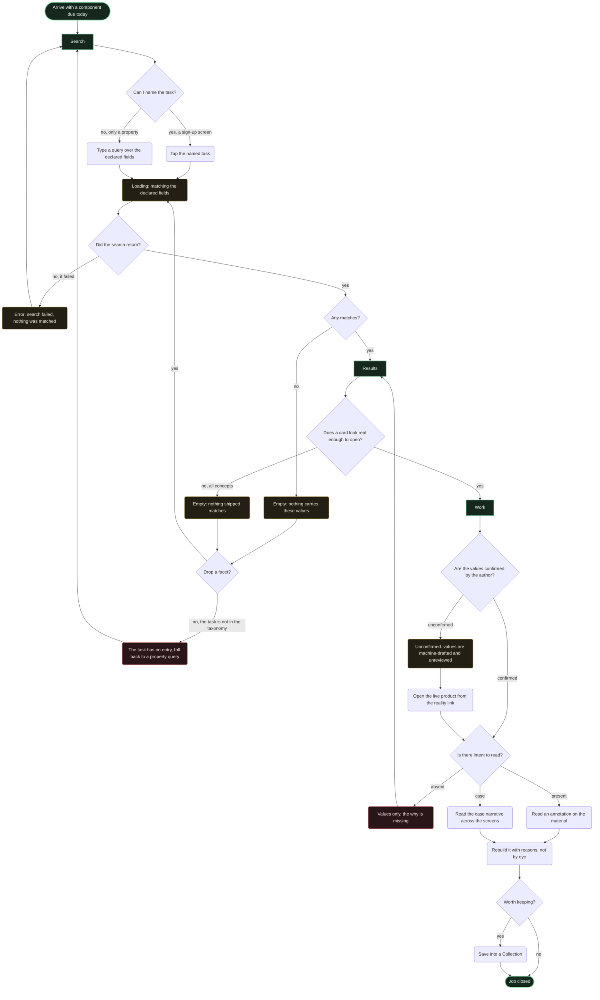
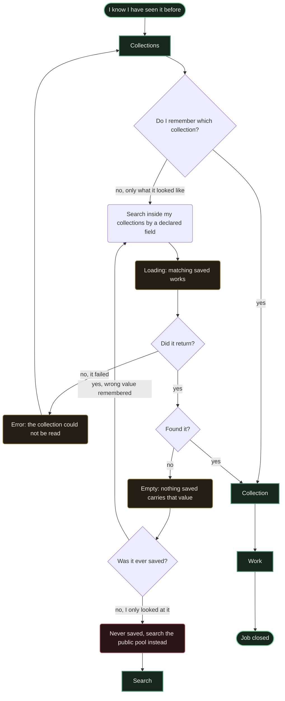
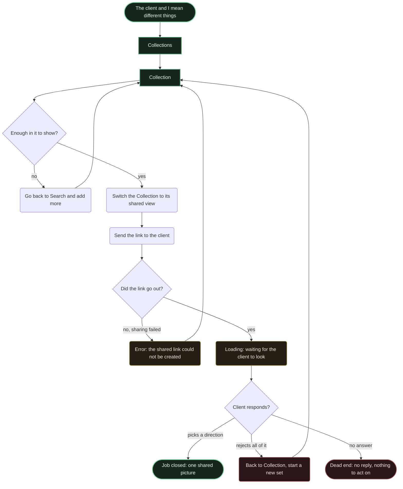
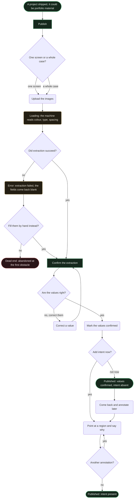

<!-- filled by /dsf:ia — start from this skeleton, do not restructure it -->

# Flows

**The main-job flow, complete, plus three key related-job flows** from `jtbd.md`. One
`flowchart TD` per flow, each under a heading naming its job.

**Node shapes carry meaning, and only one of them is a screen:**

| Shape | Means |
|---|---|
| `[Square]` | **a screen**, named exactly as in `ia/sitemap.md` — only these seven: `Search`, `Results`, `Work`, `Collections`, `Collection`, `Publish`, `Confirm the extraction` |
| `(Rounded)` | an action or a state — something a person does, or a condition a screen is in. **Not a destination** |
| `{Diamond}` | a decision, with labelled branches |
| `([Stadium])` | an entry or an ending |

*Corrected 2026-08-07 at the critique gate: eight action nodes had been drawn with screen syntax,
which made the sitemap and the flows unreadable together.*

---

## Flow 1 — Main: build from reasons rather than by eye

**Decisions in words**

| Decision | Yes branch | No branch |
|---|---|---|
| Can I name the task? | The R1 entry — tap the named task, no query to compose | Fall back to a query over the declared fields; both land on the same `Results` |
| Did the search return? | Carry on to the match count | **Error** — and the way out is back to `Search`, not a blank page |
| Any matches? | `Results` | `Empty` — drop a facet, or admit the task is absent from the taxonomy |
| Does a card look real enough to open? | `Work` | A second empty: matches exist but none shipped. R2 acting **before** the click, which is the point |
| Are the values confirmed? | Read them as the author's claim | `Unconfirmed` — machine-drafted, so the reality link is the fallback proof |
| Is there intent to read? | `present` → one annotation · `case` → the narrative | `absent` → **back to `Results`.** The market's failure, and the person does not pay a session for it |

**States in words**

| State | What triggers it | The way out |
|---|---|---|
| Loading | A query or a task tap | Resolves to `Results`, to `Empty`, or to the error |
| Error — search failed | The match never returns | Back to `Search` |
| Empty — nothing carries these values | A facet combination returns zero | Drop a facet, or fall back to a property query |
| Empty — nothing shipped matches | Matches exist, all concepts | Same exit; R2 is what makes it distinct from the empty above |
| Unconfirmed | The author never reviewed the extracted values | The reality link — read the live product instead of the draft |

**Endings:** success — the person rebuilds from stated reasons, optionally saving · **no dead ends
left.** Both former dead ends now return: a task outside the taxonomy falls back to a property
query, and a work with no intent returns to `Results`.

---

## Flow 2 — R3: get back to what I already found

**Decisions in words:** *Do I remember which collection?* — yes goes straight in; no falls back to
searching **inside** saved works by a declared field, the thing no competitor does (Eagle does it
privately and desktop-only, `[RES · Re-research · Q3]`). *Did it return?* — the error returns to
`Collections`. *Was it ever saved?* — the empty asks the honest question, because "wrong value
remembered" and "never saved" need different help.

**States in words:** *Loading* — matching saved works. *Error* — the collection could not be read;
back to `Collections`. *Empty* — nothing saved carries that value.

**Endings:** success — back on the `Work` · **no dead end left**: never having saved it now routes
to `Search`, which is what the node always promised and the graph did not deliver.

---

## Flow 3 — R4: one shared picture with the client

**Decisions in words:** *Enough in it to show?* — the collection doubles as the working set and as
the thing shown, so the only preparation is adding more. *Did the link go out?* — added at the
critique gate; sharing is the one thing here that can fail technically. *Client responds?* — three
branches, two of them not success.

**States in words:** *Error* — the shared link could not be created; back to `Collection`.
*Loading* — waiting on a person outside the product, the one wait this product cannot shorten.

**Endings:** success — a direction is picked · dead ends — the client rejects everything
(recoverable, back to the set) or does not answer at all. **The second is not recoverable inside the
product, and that is honest rather than lazy: no screen can make a person reply.**

**Note on scope:** the shared view is a **mode** of `Collection`, decided at the sitemap gate. This
flow adds no screen — the whole reason R4 could be served without new scope.

---

## Flow 4 — HJ1: publish a work and confirm its breakdown

**Decisions in words:** *One screen or a whole case?* — both first-class, so a choice, not a gate.
*Are the values right?* — correcting loops back rather than restarting. *Add intent now?* — **the
only branch that matters for the product's survival**, deliberately skippable: "not now" publishes a
real, findable work, and the way back is always open.

**States in words:** *Loading* — extraction; on fixtures this is simulated, per the brief's
constraints. *Error* — extraction failed and the fields come back blank; the exit is filling them by
hand, and refusing that is the abandonment criterion 3 is written against.

**Endings:** success — two, deliberately: **published with intent absent** and **published with
intent present**. The first is a real success, because the brief makes publishing with a minimum
legitimate. Dead end — abandonment at a failed extraction with no appetite to type. **Kept on
purpose: it is the exact thing the brief's criterion 3 measures.**

**The honest caveat:** this flow serves **HJ1 and HJ2, both hypotheses with no evidence behind
them.** It is drawn because the brief's criterion 3 demands it. If HJ1 fails, this flow is the first
thing that changes.

---

## Coverage

| Flow | Job | Screen nodes | States present | Both endings? |
|---|---|---|---|---|
| 1 | **Main** (+ R1, R2, R5, S1) | `Search`, `Results`, `Work` | loading · error · empty ×2 · unconfirmed | ✅ success · no dead end left |
| 2 | **R3** | `Collections`, `Collection`, `Work`, `Search` | loading · error · empty | ✅ success · no dead end left |
| 3 | **R4** | `Collections`, `Collection` | loading · error | ✅ success + 2 dead ends, one deliberate |
| 4 | **HJ1** (+ HJ2, criterion 3) | `Publish`, `Confirm the extraction` | loading · error | ✅ 2 successes + 1 deliberate dead end |

**Nodes added to `ia/sitemap.md` while drawing these flows:** none. Every screen node was already in
the tree — which is what the sitemap gate was for.

**Two dead ends survive on purpose**, both in states the product cannot fix from inside: a client
who never replies (Flow 3) and an author who abandons a failed extraction rather than typing
(Flow 4). The second is what the brief's criterion 3 exists to measure, so removing it would remove
the measurement.
